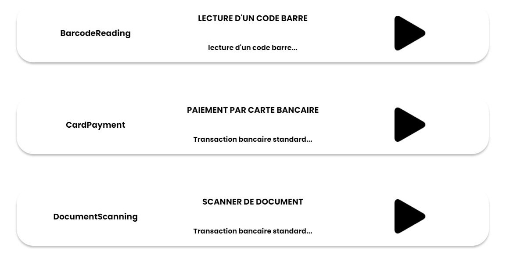
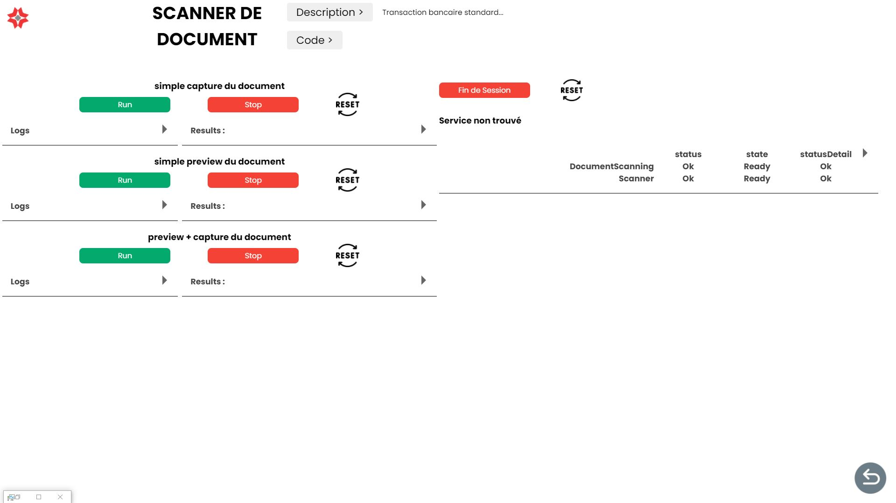

# DEMOSKV2

## Fonctionnalité

- [~] Choix du profil utilisateur
- [ ] Picker de scénario ( création de scénario à partir d'un picker de fonctionnalitées prédéfinies)
- [x] Portail vers les applications de démonstration
- [x] Page de lancement et de surveillance des tests / scénarios de fonctionnalités

### 1. Choix du profil utilisateur

**A faire :**
Il faut que l'utilisateur, lorsqu'il ouvre l'application, puisse choisir un profil. Ce profil définit les manipulations qu'il pourra effectuer dans l'application.

Pour le moment il n'y a que l'interface du choix qui est faite. Il faut donc ajouter les fonctionnalités qui permettront de définir les actions de l'utilisateur en fonction du profil choisi.

---

### 2. Picker de scénario

**A faire :**
Le but de cette fonctionnalité est de permettre à l'utilisateur de choisir des fonctionnalités prédéfinies pour créer un scénario. Ce scénario pourra être lancé par l'utilisateur.

---

### 3. Portail vers les applications de démonstration

Cette partie de l'application permet de lancer les applications de démonstration.

Lors de la création d'une nouvelle application de démonstration il faut :

1. Créer l'application dans le dossier `demos`

2. Créer les différentes routes internes à l'application

3. Importer les routes de l'application dans le fichier `app-routing.module.ts`

4. A chaque nouvelle application il faut rajouter un bouton dans le fichier`app-demo-choice.html`

   Exemple :

   ```html
   <div class="containerDemo nomDeApplication" routerLink="routingVersAppli">
     
     <div class="description">
       <h3>MoovHop - version EK4000</h3>
       <p>Application transports - version complète</p>
     </div>
     
   </div>
   ```

   - `routingVersAppli`: le routing vers l'application
   - `MoovHop - version EK4000`: le nom de l'application
   - `Application transports - version complète`: la description de l'application

   Résultat :
   

---

### 4. Page de lancement et de surveillance des tests de fonctionnalités

Cette page permet de lancer les tests de fonctionnalités et de surveiller leurs évolution.

Pour ajouter un test il faut :

1. Créer un fichier un fichier `.js` qui va contenir l'entièreté des informations du test.

    - Il doit contenir les informations suivantes :
      - `@title` : Le titre du test.
      - `@description` : La description du test.
      - `@service` : suivi du nom d'un service à surveiller dans le test. Il peut aussi contennir un périphérique marqué entre parentheses. Exemple : `@service BarcodeReading (BarcodeReader)`.

      Exemple :
      ``` javascript
        /**
        * @title  SCANNER DE DOCUMENT
        * @description Transaction bancaire standard
        * @service DocumentScanning (Scanner)
        * @service TicketPrinting 
        */
        ```

     - Il doit contenir les méthodes suivantes :

       - `startn`: avec n le numéro du test. ces méthodes permet de lancer le test. Elles contiennent les ajouts d'eventListeners et les appels à l'API SoftKiosk.
       - `stopn`: avec n le numéro du test. Ces méthodes permettent d'arrêter les tests. Elles contiennent les suppressions d'eventListeners et les appels à l'API SoftKiosk.
       - Différentes fonctions qui contiennent le code du test.

        Les tests doivent contenir autant de start que de stop. Les différentes fonctions doivent être appelées dans les méthodes start et stop.

     - Les logs de chaque fonctions doivent être construit de la manière suivant pour qu'ils soient traités par l'application :

       ``` javascript
       console.log("TYPE - Message");
       ```

       Avec les docnnées suivantes :

       - TYPE :

         - `START` : Pour indiquer le début du test.
         - `USER` : Pour indiquer une action de l'utilisateur.
         - `PREVIEW` : Pour afficher une donnée de prévisualisation (caméra, scanner).
         - `CAPTURE` : Pour indiquer la capture d'une information (caméra, scanner, lecteur QR Code ...).
         - `ERROR` : Pour indiquer une erreur donc la fin du script.
         - `END` : Pour indiquer la fin de l'action.

       - Le Message contient les informations que le dveloppeurs souhaite afficher. C'est la seul partie qui sera présente dans l'application.

     - Le fichier doit contenir les différentes variables qui peuvent être modifié par l'utilisateur.

        ```javascript
        /**
          * @param {number} amountInCents - Default: 100 - Montant en centimes
          * @param {string} refTransaction - Default: ref-deb-0000 - Référence de la transaction
          * @param {string} refShoppingCart - Default: ticket-1234 - Référence du panier
        */
        ```

      - Il peut contenir des commentaires pour expliquer une fonction, cette description sera affiché au niveau des tests.

        ```javascript
        /**
          * Confirmation de transaction
          */
        function start1() {}
        ```

    - Exemple de fichier de test JavaScript :

        ```javascript
        /**
          * @title  SCANNER DE DOCUMENT
          * @description Transaction bancaire standard
          * @service DocumentScanning (Scanner)
          * @service TicketPrinting 
          */

        /**
          * lancement de la lecture de code barre
          */
        function start1() {
          console.log("START - Lancement de la lecture de code barre");
          Kiosk.BarcodeReading.addEventListener("barcodeRead", onBarcodeRead);
          Kiosk.BarcodeReading.readBarcode();
        }

        function onBarcodeRead(e) {
          switch (e.data.dataType) {
              case "BarcodeRead":
                console.log("CAPTURE - Code barre lu: " + e.data.barcode);
                Kiosk.BarcodeReading.removeEventListener("barcodeRead", onBarcodeRead);
                console.log("FIN - Arret de la lecture de code barre");
                break;
              default:
                break;
          }
        }

        function stop1() {
          console.log("FIN - Arret de la lecture de code barre");
          Kiosk.BarcodeReading.stopReadBarcode();
          Kiosk.BarcodeReading.removeEventListener("barcodeRead", onBarcodeRead);
        }
        ```

2. Ajouter le nom du test dans le fichier poc.txt du dossier assets de DemoSKV2.

    - Il faut ajouter le nom du test dans la liste `featuresList` du fichier `poc.txt`.

    Exemple :
   ```txt
    Barcode_Reading
    Document_Scanning
    CardPayment_Debit
    Document_Printing
    Session
    ContactlessReading
    ContactLessReading_Calypso
    Ticket_Printing
   ```

   Chaque élément de la liste va créer un bouton dans l'interface de l'application.

Exemple de boutons :


Interface résultat pour le test du scanner de document :



Ci-dessous un exemple d'interface après le lancement d'un test :


Ci dessous le fichier pour réaliser l'interface et le test :

- [Barcode_Reading.js](../../assets/DemoSKV2/confTest/script/Document_Scanning.js)


## DemoSKV2

### Ajout d'un type de log

Pour ajouter un type de log il faut créer une condition dans la redéfintion du `console.log` dans le fichier `feature-run.component.ts` à la ligne 340.  
- **Ajout d'un log simple** : Le code ci-dessous est un exemple de condition pour un nouveau type de log . Le contenu du log est affiché dans une balise `<div>` dans la section Logs du test.

```typescript
    else if (logType == nouveauTypeDeLog) {
        var logElement = document.getElementById("panel_Logs_" + actualLogLocationLocal);
        logElement!.innerHTML += "<div>" + logContent.slice(0, 20) + "...</div>";
        _this.compteur = 0;
    }
}
```

- **Ajout d'un log de fin de test** : Le code ci-dessous est un exemple de condition pour un nouveau type de log . Le contenu du log est affiché dans une balise `<div>` dans la section Results du test.

```typescript
    else if (logType == nouveauTypeDeLog) {
        let hour = new Date();
        const heure = hour.getHours().toString().padStart(2, "0");
        const minutes = hour.getMinutes().toString().padStart(2, "0");
        const secondes = hour.getSeconds().toString().padStart(2, "0");
        const hourFormatted = `${heure}:${minutes}:${secondes}`;
        document.getElementById("panel_Logs_Results_" + actualLogLocationLocal)!.innerHTML += "<div>" +hourFormatted+ " : "+ logContent.slice(0, 20) + "...</div>";
        document.getElementById("playBtn_" + actualLogLocationLocal)!.style.opacity = "1";
        (document.getElementById("playBtn_" + actualLogLocationLocal) as HTMLButtonElement)!.disabled = false;
        _this.firstPreview = true;
        _this.isRunning = false;
    }
```

Avec `nouveauTypeDeLog` le nouveau type de log.

