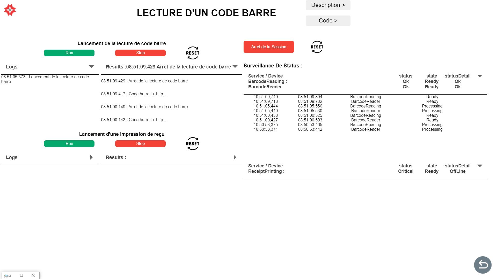

# DEMOSKV2 

## Fonctionnalité 

- [~] Choix du profil utilisateur 
- [ ] Picker de scénario ( création de scénario à partir d'un picker de fonctionnalitées prédéfinies)
- [x] Portail vers les applications de démonstration
- [x] Page de lancement et de surveillance des tests / scénarios de fonctionnalités 

### Portail vers les applications de démonstration

Cette partie de l'application permet de lancer les applications de démonstration.

Lors de la créaton d'une nouvelle application de démonstration il faut :

1. Créer l'application dans le dossier `demos`

2. Créer les différentes routes interne à l'application

3. Importer les routes de l'applications dans le fichier àpp-routing.module.ts` 

4. A chaque nouvelle application il faut rajouter un bouton dans le fichier `app-demo-choice.html` 

    Exemple :
    ```html
    <div class="containerDemo nomDeApplication" routerLink="routingVersAppli">
        
        <div class="description">
            <h3> MoovHop - version EK4000 </h3>
            <p> Application transports - version complète   </p>
        </div>
        
        </div>
    ```
    - `routingVersAppli`: le routing vers l'application
    - `MoovHop - version EK4000`: le nom de l'application
    - `Application transports - version complète`: la description de l'application

    Résultat :
    

---

### Page de lancement et de surveillance des tests de fonctionnalités

Cette page permet de lancer les tests de fonctionnalités et de les surveiller. 

Pour rajouter un test il faut : 

1. Ajouter deux fichiers : le premier un fichier `.json` qui contient les information tel que le titre du test, la description, les périphériques et les services utilisé par le test. Le deuxième fichier est un fichier `.js` qui contient les méthodes de test. Ces deux fichiers ont le même nom (exemple : BarcodeReading.js et BarcordReading.json). 
    - Le fichier JSON :
        - Il doit avoir pour scquellette :
        ```json
        {
            "title": "nom du test",
            "description": "description du test",
            "serviceUSed": [
                {
                    "name": "nom du service"
                },
                  ...
            ],
            "perifUsed": [
                {
                    "name": "nom du periphérique"
                },
                ...
            ]
        }
        ```
        - Exemple de fichier JSON : 

        ```json
        {
            "title": "Lecture d'un code barre",
            "description": "Lecture d'un code barre",
            "serviceUSed": [
            {
                "name": "BarcodeReading"
            }
            ],
            "perifUsed": [
                {
                    "name": "BarcodeScanner"
                }
            ]
        }
        ```
    - Le fichier JS : 
        - Il doit contenir les méthodes suivantes : 
            - `startn`: avec n le numéro du test. ces méthodes permet de lancer le test. Elles contiennent les ajouts d'eventListeners et les appels à l'API SoftKiosk.
            - `stopn`: avec n le numéro du test. Ces méthodes permettent d'arrêter les tests. Elles contiennent les suppressions d'eventListeners et les appels à l'API SoftKiosk. 
            - Les différentes méthodes qui permettent de lancer les actions du test.

        - Les logs de chaque fonctions doivent être construit de la manière suivant pour qu'ils soient traités par l'application :
            ```
            console.log("TYPE - Message");
            ```
            Avec les docnnées suivantes :
            - TYPE :
                - `START` :  Pour indiquer le début du test.
                - `USER` : Pour indiquer une action de l'utilisateur.
                - `PREVIEW` :  Pour afficher une donnée de prévisualisation (caméra, scanner).
                - `CAPTURE` : Pour indiquer la capture d'une information (caméra, scanner, lecteur QR Code ...).
                - `END` :  Pour indiquer la fin de l'action.
            
            - Le Message n'est pas fixe. C'est la seul partie affiché dans l'application.              
        
        - Il doit contenir les différentes variables qui peuvent être modifié par l'utilisateur. 
        ``` javascript
            /**
            * @param {number} amountInCents - Default: 100 - Montant en centimes
            * @param {string} refTransaction - Default: ref-deb-0000 - Référence de la transaction
            * @param {string} refShoppingCart - Default: ticket-1234 - Référence du panier
            */
        ```
        - Il doit contenir une petite description du test. 
        ``` javascript
            /**
             * Confirmation de transaction
            */
            function start1() {
            }
        ```
        - Exemple de fichier de test JavaScript : 
        ``` javascript
        /**
         * @title  LECTURE D'UN CODE BARRE
        * @description lecture d'un code barre
        */

        /**
        * lancement de la lecture de code barre 
        */
        function start1(){
            console.log("START - Lancement de la lecture de code barre");
            Kiosk.BarcodeReading.addEventListener('barcodeRead', onBarcodeRead);
            Kiosk.BarcodeReading.readBarcode();
        }

        function onBarcodeRead(e) {
            switch (e.data.dataType) {
                case 'BarcodeRead':
                    console.log("CAPTURE - Code barre lu: " + e.data.barcode);
                    Kiosk.BarcodeReading.removeEventListener('barcodeRead', onBarcodeRead);
                    console.log("FIN - Arret de la lecture de code barre");
                    break;
                default:
                    break;
            }
        }

        function stop1(){
            console.log("FIN - Arret de la lecture de code barre")
            Kiosk.BarcodeReading.stopReadBarcode();
            Kiosk.BarcodeReading.removeEventListener('barcodeRead', onBarcodeRead);
        }
        ```

2. Ajouter un bouton dans le fichier `app-demo-choice.html`
    ```html
    <div class="containerDemo testChoice" (click)="ChooseScript('nomDuTest')">
        
        <div class="description">
            <h3> nomDuTest </h3>
        </div>
        
        </div>
    ```

    Avec `nomDuTest` le nom du fichier json (qui est le même que le fichier js).

    Exemple de bouton :
    


Interface résultat pour le test de paiement par carte bancaire:


Ci dessous les deux fichier qui ont permis de réaliser ce test:

- [CardPayment.js](../../assets/DemoSKV2/confTest/script/CardPayment_Debit.js)
- [CardPayment.json](../../assets/DemoSKV2/confTest/CardPayment_Debit.json)


---


## Maintenance de DemoSKV2


### Ajout d'un type de log 

Pour ajouter un type de log il faut créer une condition dans la redéfintion du `console.log` dans le fichier `feature-run.component.ts` à la ligne 340.  
Le code ci-dessous est un exemple de condition pour un nouveau type de log (section dites Logs). 
```typescript
    else if (logType == nouveauTypeDeLog) {
        var logElement = document.getElementById("panel_Logs_" + actualLogLocationLocal);
        logElement!.innerHTML += "<p>" + logContent.slice(0, 20) + "...</p>";
        _this.compteur = 0;
    }
}
```
Pour une section de type Result il faut avoir un code comme celui ci.
```typescript
    else if (logType == nouveauTypeDeLog) {
        let hour = new Date();
        const heure = hour.getHours().toString().padStart(2, "0");
        const minutes = hour.getMinutes().toString().padStart(2, "0");
        const secondes = hour.getSeconds().toString().padStart(2, "0");
        const hourFormatted = `${heure}:${minutes}:${secondes}`;
        document.getElementById("panel_Logs_Results_" + actualLogLocationLocal)!.innerHTML += "<p>" +hourFormatted+ " : "+ logContent.slice(0, 20) + "...</p>";
        document.getElementById("playBtn_" + actualLogLocationLocal)!.style.opacity = "1";
        (document.getElementById("playBtn_" + actualLogLocationLocal) as HTMLButtonElement)!.disabled = false;
        _this.firstPreview = true;
        _this.isRunning = false;
    } 
```

Avec `nouveauTypeDeLog` le nouveau type de log.

Ci-dessous un exemple d'interface après le lancement d'un test :

  

